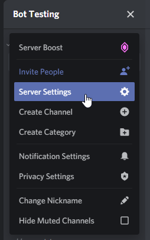
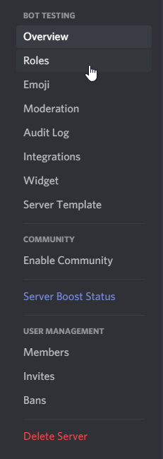
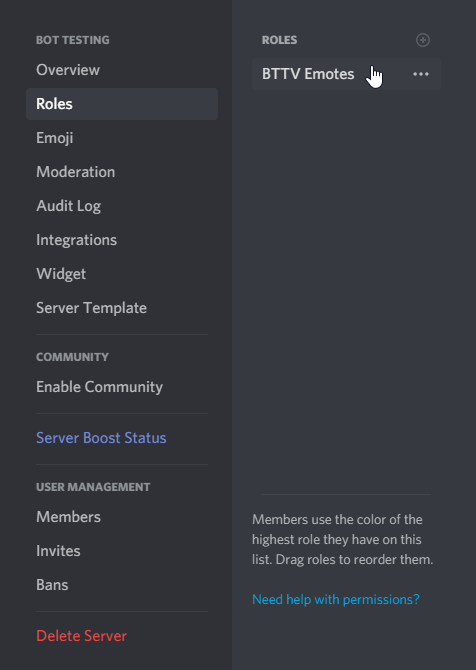
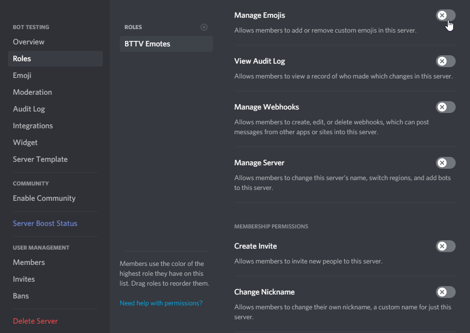
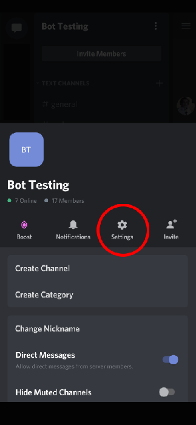
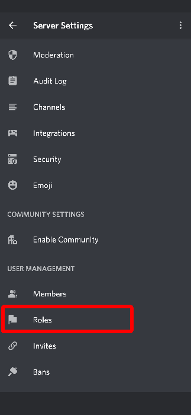
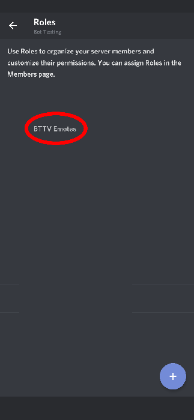
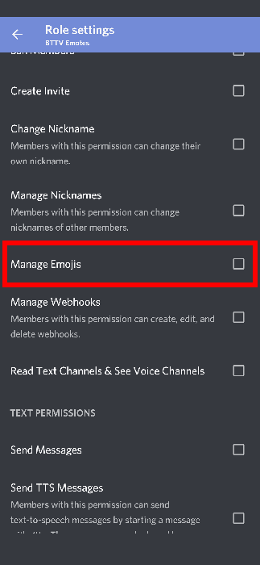

## Missing Permissions
If whenever you try to use the `addemotes` command and it says you need to give the bot permissions, this is how:

*Only users with the manage roles permission can do the following*

First, click the corrosponding referral link for your device:

<a href="#desktop">Desktop</a>

<a href="#iphone">iPhone</a>

<a href="#android">Android</a>

### Desktop
First click the dropdown in the top right

Now click the roles tab

Find the `BTTV Emotes` role and click on it

Finally, scroll to the `Manage Emojis` role and check it green

Now the command should work! If you still have this problem, [create an issue](https://github.com/MrAuro/OuraEmotes/issues/new/choose)

---
### iPhone

This is currently undocumented. However [this guide from Discord may help you](https://support.discord.com/hc/en-us/articles/206029707-How-do-I-set-up-permissions-)

Feel free to create a pull request if you want to document this.

---
### Android
First open the server settings by clicking the 3 dots and clicking the settings button

Now scroll down and click the roles tab

Find the `BTTV Emotes` role and click on it

Finally, scroll to the `Manage Emojis` role and check it green

Now the command should work! If you still get this problem, contact Auro, or [create an issue](https://github.com/MrAuro/OuraEmotes/issues/new/choose)